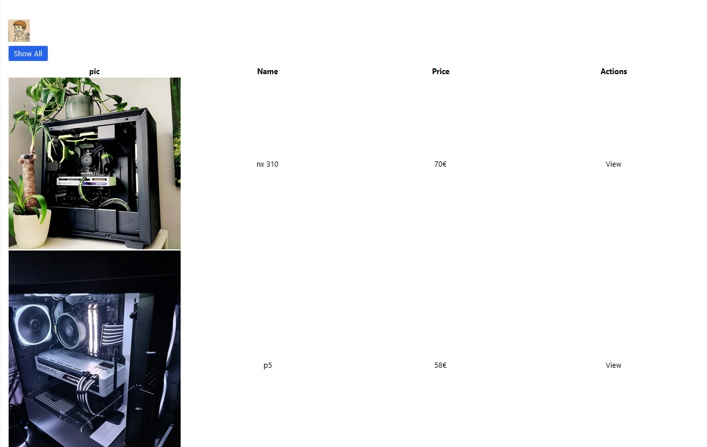

  

# liste de produits
Projet pour apprendre à créer un objet en JS. 
- [x] Creation de l'objet boitier avec une image, un prix, un nom et on l'affiche dans le HTML. 
- [ ] Utilisation de Node.JS pour stocker l'objet dans une DB
 

